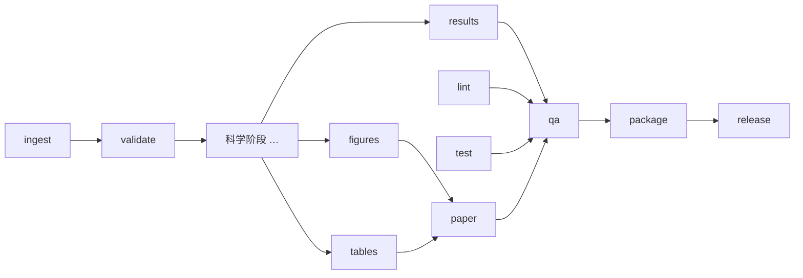

# 架构

## 分层

```
┌──────────────────────────────────────────────────────────────┐
│ 控制面（本地，仅文本与提交）  tools/cli.py · Makefile · git      │
├──────────────────────────────────────────────────────────────┤
│ 计算面（Modal）              forge/modal_app.py                 │
│   image = debian-slim + TeX Live + Noto CJK + 固定版本 Python 栈 │
│   /repo  只读挂载的仓库      /vol  持久卷 cumcm2026-e-artifacts │
├──────────────────────────────────────────────────────────────┤
│ 运行时（forge/）  runner · context · manifest · contracts · xlsx │
│                   tex · pdfqa · packaging · plotting · events  │
├──────────────────────────────────────────────────────────────┤
│ 流水线（pipelines/）  common: ingest lint test paper qa package release │
│                        e: validate + 科学阶段 + results/figures/tables │
├──────────────────────────────────────────────────────────────┤
│ 论文（manuscript/）  main.tex + sections/ + references.bib + generated/(云端) │
└──────────────────────────────────────────────────────────────┘
```

## 阶段 DAG



`paper.sources`（configs/default.toml）声明哪些阶段的 `tables/` 与 `figures/` 进入排版；`package.stages` 声明哪些阶段目录进入支撑材料。

## 数据流

1. `ingest`：原始 xlsx → parquet（`ingest/data/*.parquet`）+ `inventory.json`（SHA-256、表结构）+ `problem_text.txt`。
2. `validate`：契约校验 → `validation_report.json`、`data_profile.json`。
3. 科学阶段：读取 parquet，写 `*.json`/`*.parquet`/`numbers.json`；`results` 用模板生成 `result*.xlsx`。
4. `paper`：汇总 numbers、tables、figures、代码清单、支撑清单 → `main.pdf`、`AI工具使用详情.pdf`、`paper_report.json`。
5. `qa` → `qa_report.json`；`package` → `支撑材料.zip` + `MANIFEST.json` + `REPRODUCE.md`；`release` → 交付目录 + `release_manifest.json`。

## 关键设计决策

见 `docs/adr/`。
